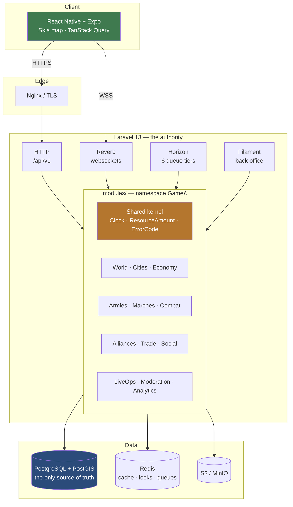

# Castle Royale

> A mobile MMO of empire building, territorial conquest and real-time strategic
> warfare. One small city, a shared persistent world, and a few thousand
> neighbours who also want it.

`Castle Royale` is a working title. The name lives in `config('game.name')` and
appears in no namespace or class — changing it is a one-line edit.

[](<>)
[](<>)
[](<>)

---

## Table of contents

- [The game](#the-game) · [Architecture](#architecture) · [Stack](#stack)
- [Repository layout](#repository-layout) · [Getting started](#getting-started)
- [Running things](#running-things) · [Quality gates](#quality-gates)
- [Documentation](#documentation) · [Roadmap](#roadmap)
- [Troubleshooting](#troubleshooting) · [Contributing](#contributing)

---

## The game

A player starts with one city and grows it into an empire:

```
Collect resources → Build city → Research → Train troops → Recruit heroes
    → Explore world → Attack NPCs → Take territory → Attack players
    → Join alliance → Fight wars → Hold strategic cities → Dominate regions
    → Compete for server supremacy
```

The loop has to stay interesting for a player with ten minutes a day and for one
with three hours.

### The principle everything else follows from

**The server owns the truth.** A player's empire is exactly what the server says it
is — always, even when the client is hostile. The client sends _intent_; the server
computes _outcome_. Assume the app is decompiled, its traffic rewritten, its clock
forged, and its requests replayed, because eventually it will be.

Consequences, all deliberate: integer-only economy with an append-only ledger,
deterministic seeded combat that replays years later, server-authoritative time,
and no gameplay action that can be confirmed offline.

### Principal systems

| System         | What it does                                         | Phase |
| -------------- | ---------------------------------------------------- | ----- |
| World          | Sharded, persistent, PostGIS-indexed map             | 05–06 |
| City           | Buildings, production, construction queues           | 07–09 |
| Economy        | Integer resources, ledger, concurrency-safe spending | 08    |
| Technology     | Acyclic research tree with data-driven effects       | 10    |
| Units & Heroes | Roster, counters, commanders                         | 11–14 |
| Marches        | Server-timed movement with reliable arrival          | 15    |
| Combat         | Deterministic, seeded, replayable simulation         | 17–18 |
| Conquest       | PvP, siege, city capture, territory                  | 19–21 |
| Alliances      | Permissions, rallies, diplomacy                      | 22–26 |
| Market         | Trade with conservation guarantees                   | 27    |
| LiveOps        | Events, seasons, feature flags — no deploy           | 31–32 |

---

## Architecture

A **modular monolith** (ADR-001). One deployable, module boundaries enforced by
architecture tests rather than by network calls.



Redis is never authoritative for anything a player owns (ADR-005). Losing it
degrades the game; it cannot corrupt it.

All 17 decisions are in [`docs/adr/`](docs/adr/README.md).

---

## Stack

**Backend** — PHP 8.4 · Laravel 13 · PostgreSQL 16 + PostGIS · Redis 7 · Horizon ·
Reverb · Octane · Sanctum · Filament · Pest · PHPStan level 8 · Pint

**Mobile** — Expo SDK 57 · React Native 0.86 · TypeScript strict · Expo Router ·
TanStack Query · Zustand · Reanimated · Gesture Handler · Skia · MMKV · SecureStore

**Infra** — Docker · Nginx · Terraform · OpenTelemetry · GitHub Actions

---

## Repository layout

```
apps/api/         Laravel — the authority
  modules/        Game code, namespace Game\
apps/mobile/      Expo client
packages/
  contracts/      OpenAPI spec + generated TS types
  game-data/      All balance numbers, versioned and validated
  localization/   pt-BR · en · es
  tooling/        ESLint, tsconfig bases, design tokens
infrastructure/   docker · nginx · terraform · monitoring
docs/             ADRs, architecture, game design, security, operations
.planning/        The machine-readable GSD plan (55 phases)
```

---

## Getting started

**Requirements:** Docker + Docker Compose, Node 20+, Git. PHP and Composer are only
needed for running backend tooling directly on the host.

```bash
git clone <repo> && cd CastleRoyale
make setup     # build images, install deps, migrate, seed
make dev       # start the stack
make smoke     # prove it: every service healthy, health endpoint ok
```

| Service     | URL                                 |
| ----------- | ----------------------------------- |
| API         | http://localhost:8080               |
| Health      | http://localhost:8080/api/v1/health |
| Back office | http://localhost:8080/admin         |
| Horizon     | http://localhost:8080/horizon       |
| Reverb      | ws://localhost:8081                 |
| Mailpit     | http://localhost:8025               |
| MinIO       | http://localhost:9000               |

Local back-office credentials come from `ADMIN_SEED_EMAIL` / `ADMIN_SEED_PASSWORD`.
Outside local the seeder refuses to invent a password.

```bash
make dev                              # API, database and realtime services
npm run mobile                        # Expo Go over the local network
# or, when a custom native development build is installed:
npm run mobile:dev-client
```

When using a physical phone, keep it on the same Wi-Fi as the computer. The
mobile client automatically replaces the development `localhost` API address
with the computer address advertised by Expo. For a different API host, set
`EXPO_PUBLIC_API_URL` before starting Metro.

Environment variables are documented inline in `apps/api/.env.example`.

---

## Running things

```bash
make dev · stop · migrate · seed · reset · logs · shell
make health          # /api/v1/health returns 200 with every check true
make smoke           # every service healthy + health endpoint ok
make test-postgres   # PostGIS-only tests against real PostgreSQL
```

---

## Quality gates

Every one of these must pass before a phase is done. Not "should pass" — run them.

```bash
cd apps/api
./vendor/bin/pest                              # tests, incl. architecture rules
./vendor/bin/phpstan analyse --memory-limit=1G # level 8 + strict rules
./vendor/bin/pint --test                       # formatting

npm run typecheck && npm run lint && npm test  # from the root
npm run contracts:check                        # TS types match the OpenAPI spec
```

The architecture tests are the interesting ones: they fail the build if the domain
layer imports the framework, if a game rule calls `now()`, or if `strict_types` is
missing anywhere under `Game\`.

---

## Documentation

| Area          | Start here                                                       |
| ------------- | ---------------------------------------------------------------- |
| Decisions     | [`docs/adr/README.md`](docs/adr/README.md)                       |
| Backend       | [`docs/backend/architecture.md`](docs/backend/architecture.md)   |
| Database      | [`docs/database/conventions.md`](docs/database/conventions.md)   |
| API           | [`docs/api/api-guidelines.md`](docs/api/api-guidelines.md)       |
| Mobile        | [`docs/mobile/architecture.md`](docs/mobile/architecture.md)     |
| Realtime      | [`docs/realtime/architecture.md`](docs/realtime/architecture.md) |
| Security      | [`docs/security/threat-model.md`](docs/security/threat-model.md) |
| Game design   | [`docs/game-design/`](docs/game-design/)                         |
| Design system | [`docs/design-system/tokens.md`](docs/design-system/tokens.md)   |
| **AI agents** | [`AGENTS.md`](AGENTS.md)                                         |

---

## Roadmap

**55 phases**, all planned to an executable level before any of them run. Each
carries a goal, dependencies, observable success criteria and pre-locked
implementation decisions.

| Milestone          | Phases | Delivers                                             |
| ------------------ | ------ | ---------------------------------------------------- |
| Foundation         | 00–02  | A repository that builds, tests and documents itself |
| Playable Prototype | 03–12  | One player grows a city in a real world              |
| Internal Alpha     | 13–18  | Heroes, armies, movement, deterministic combat       |
| Multiplayer Alpha  | 19–27  | Conquest, alliances, diplomacy, trade                |
| Closed Alpha       | 28–35  | Retention systems and operator tooling               |
| Beta               | 36–47  | Hardened, measured, balanced, accessible             |
| Release            | 48–53  | Alpha, beta, production infrastructure, launch       |
| LiveOps            | 54     | Running as a live service                            |

Current state: **Phase 00 complete, Phase 01 ready.**
Full plan: [`.planning/ROADMAP.md`](.planning/ROADMAP.md).

---

## Troubleshooting

**`could not find driver` when running `php artisan migrate` on the host**
The host PHP has no `pdo_pgsql`. Run migrations through Docker: `make migrate`.
The test suite uses SQLite in-memory, which is why it runs on the host.

**Tests pass but a PostGIS migration fails in CI**
Expected. The suite runs on SQLite and cannot cover PostGIS. Tag Postgres-only
tests for the CI job — see `.planning/codebase/TESTING.md`.

**`make setup` fails with "service api is not running"**
Fixed in Phase 01: `setup` now runs `docker compose up -d --wait` before any
`exec`-based target. If you see this on an old checkout, run `make dev` first.

**Metro cannot resolve a workspace package / duplicate React errors**
Expo SDK 57 owns the monorepo Metro defaults. Keep `metro.config.js` based on
`getDefaultConfig(__dirname)` so nested Expo dependencies and workspace packages
resolve together.

**Reanimated worklet errors**
`react-native-worklets/plugin` must be the **last** entry in `babel.config.js`.

**`npm install` fails with ERESOLVE on `openapi-typescript`**
Its peer range is stale (declares TS ^5, we are on TS 6). The root `overrides`
entry handles it — do not switch to `--legacy-peer-deps`.

**`php artisan install:broadcasting` crashes**
It needs a TTY. Reverb is already configured; do not re-run it.

---

## Contributing

See [`CONTRIBUTING.md`](CONTRIBUTING.md). Conventional commits, one logical change
each, no `Co-Authored-By` trailers. Security issues: [`SECURITY.md`](SECURITY.md).

## License

Proprietary. All rights reserved. See [`LICENSE`](LICENSE).
