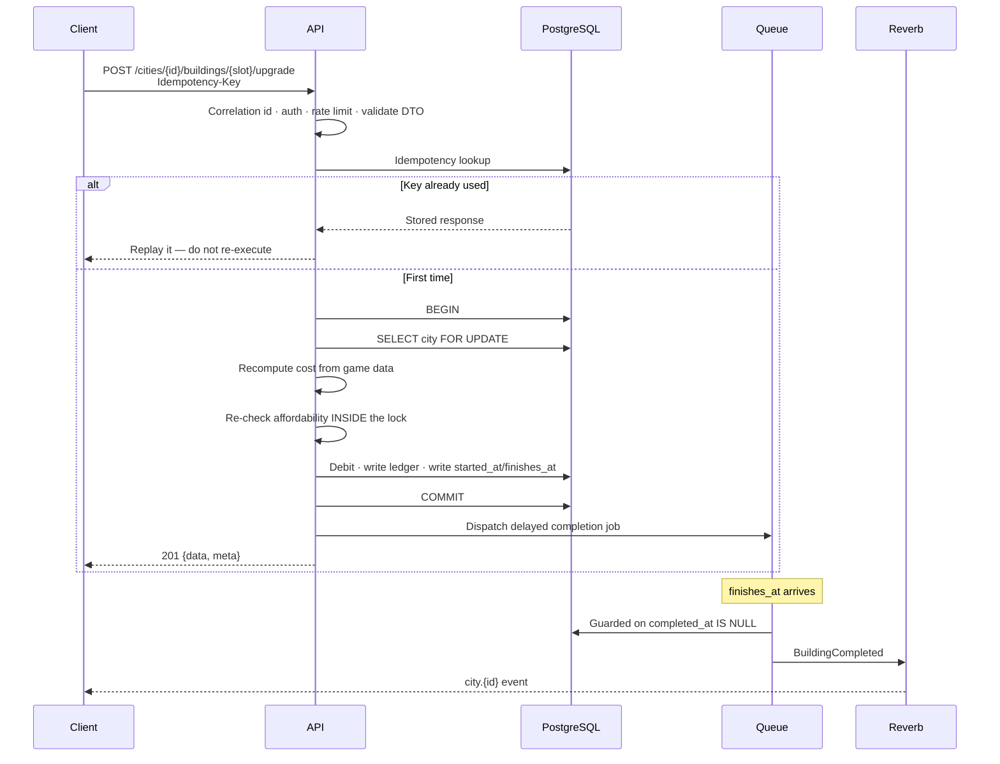
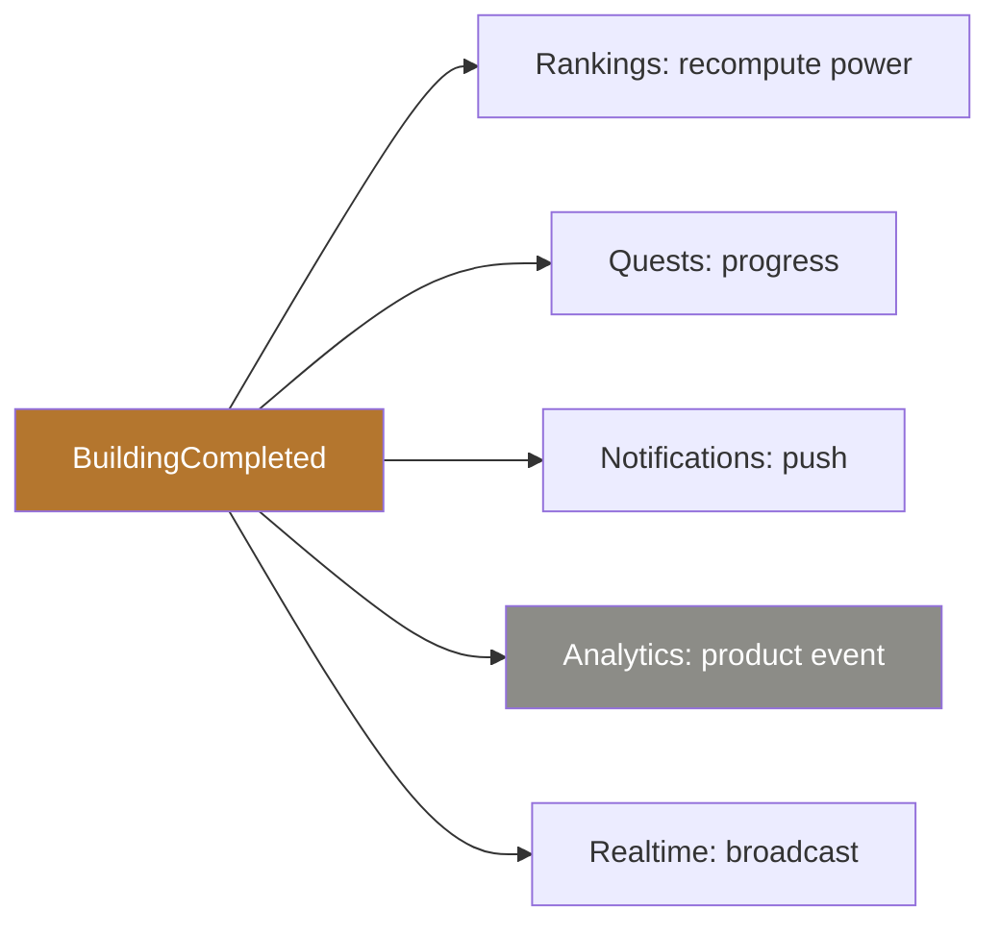

# Data flow

How a tap on a phone becomes durable state, and how the world learns about it.

## A command: upgrading a building



The three load-bearing details: the cost is recomputed server-side and never read
from the request; affordability is checked **inside** the lock; and the completion
job is guarded on `completed_at`, not `finishes_at`.

## Reads: production accrual

Resources are **not** ticked by a background loop. They accrue from elapsed server
time when read:

```
credit = (now - last_accrued_at) * rate,  capped by warehouse capacity
```

then `last_accrued_at` advances in the same transaction. A city closed for six
hours and one polled every minute reach the identical total — which is exactly
what the Phase 08 test asserts.

## Events



The publisher knows none of its subscribers. Analytics sits on its own tier and
may never block or fail the transaction that produced the event.

## Failure paths

| Failure | What happens |
|---------|--------------|
| Job never runs (worker died, Redis failover) | The scheduled reconciler finds the overdue row and completes it. It races the job; the completion path is idempotent, so exactly one takes effect |
| Client retries after a committed write | Idempotency returns the stored response |
| Two clients spend the same resources | Row lock serialises them; one gets `INSUFFICIENT_RESOURCES` |
| Broadcast fan-out is slow | It is queued on `realtime`; the request already returned |
| Analytics pipeline is down | Gameplay is unaffected — asserted by a test with the dispatcher throwing |
| Client misses a realtime event | The sequence gap is detected and the client resyncs over HTTP |

## The client side

```
HTTP response  →  TanStack Query cache  →  UI
Realtime event →  invalidate or patch that same cache
```

There is one cache and one source of truth. Server state never lands in Zustand —
a second copy is a second truth, and it will drift.
