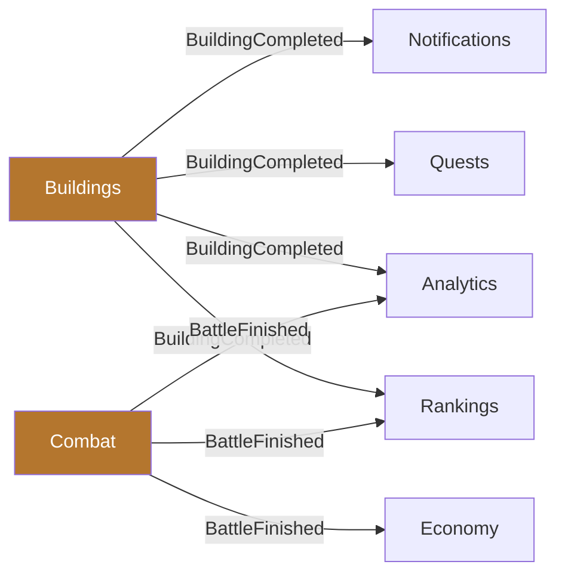

# Modules

## Boundaries

Modules live under `apps/api/modules/<Module>/` in the `Game\` namespace.

**A module may:**
- publish domain events other modules subscribe to
- expose application services other modules call
- depend on `Game\Shared`

**A module may not:**
- import another module's Eloquent models
- import another module's `Domain` namespace
- reach into another module's database tables directly

Violations fail the architecture tests.

## The Shared kernel

Everything may depend on `Game\Shared`. Nothing in `Shared` may depend on a
feature module.

| Concern | Class |
|---------|-------|
| Time | `Domain\Time\Clock`, `Infrastructure\Time\SystemClock`, `Domain\Time\FrozenClock` |
| Economy | `Domain\Economy\ResourceAmount`, `ResourceBundle`, `ResourceType` |
| Errors | `Application\Error\ErrorCode`, `GameException` |
| HTTP | `Interface\Http\ApiResponse`, `Middleware\AttachRequestContext` |

## Map

| Module | Owns | Phase |
|--------|------|-------|
| `Shared` | The kernel | 00 |
| `Platform` | Health, feature flags, content versions | 00 / 31 |
| `Identity` | Accounts, credentials, tokens, device sessions | 03 |
| `Players` | Player entity, world membership, onboarding | 04 |
| `World` | Worlds, regions, tiles, generation, viewport | 05 |
| `Cities` | Cities, build slots | 07 |
| `Economy` | Resources, production, ledger, capacity | 08 |
| `Buildings` | Catalogue, construction queue, completion | 09 |
| `Technology` | Research tree, effects | 10 |
| `Units` | Roster, stats, counters | 11 |
| `Training` | Barracks queues, batches | 12 |
| `Heroes` | Heroes, levelling, equipment, assignment | 13 |
| `Armies` | Composition, formation, reservation, power | 14 |
| `Marches` | Movement, states, arrival, recall | 15 |
| `Encounters` | NPC camps, resource nodes, gathering | 16 |
| `Combat` | Deterministic simulation, replay | 17 |
| `Territories` | Influence, strategic points, control | 21 |
| `Alliances` | Membership, ranks, permissions, rallies | 22–24 |
| `Diplomacy` | Treaties, relations | 26 |
| `Trade` | Market orders, escrow, transport | 27 |
| `Quests` | Definitions, progress, rewards | 28 |
| `Nobility` | Ranks, requirements, privileges | 29 |
| `Rankings` | Power breakdown, leaderboards | 30 |
| `LiveOps` | Events, feature flags, seasons | 31–32 |
| `Notifications` | Push, mail, preferences | 33 |
| `Administration` | Back office, audit, GM tools | 34 |
| `Moderation` | Reports, sanctions, enforcement | 35 |
| `Analytics` | Product event pipeline | 36 |
| `Social` | Chat, blocking, presence | 25 |
| `Store` | IAP, premium currency (isolated) | 50+ |

A module directory is created by the phase that owns it. Creating them all
up-front would be ceremony (ADR-001).

## Communication

The publisher knows nothing about its subscribers. Adding a reaction means adding
a listener, not editing the publisher (ADR-007).

Queued listeners must be idempotent — they are retried, and reconcilers race them.

## The Store module is deliberately isolated

Nothing in the core loop may depend on `Store`. Monetisation must never become
load-bearing for gameplay (`.planning/PROJECT.md`).
