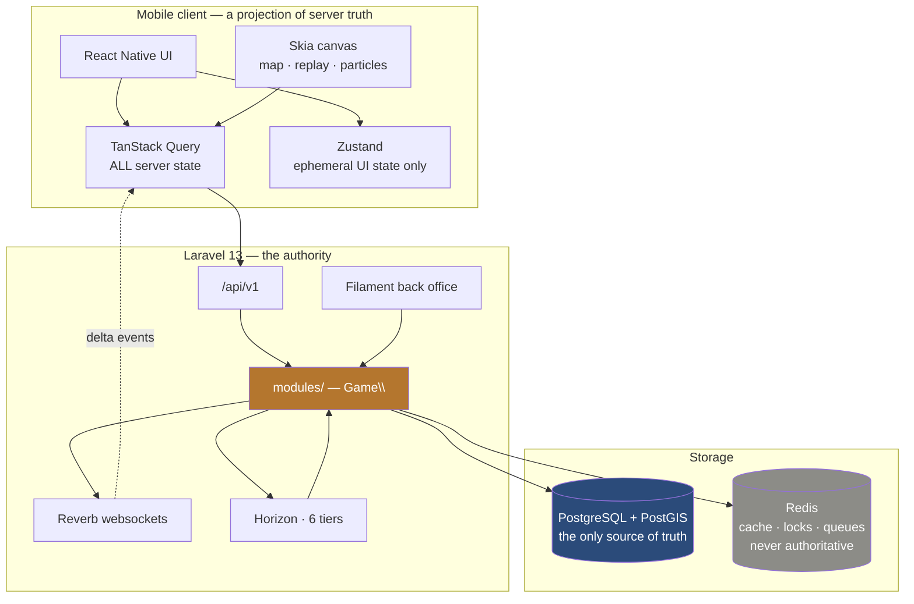

# Architecture overview

## Shape



## The four decisions everything else follows from

**1. The server owns the truth (ADR-006).** The client sends intent; the server
computes outcome. The app is assumed compromised.

**2. Modular monolith (ADR-001).** One deployable. Module boundaries enforced by
architecture tests, not by network calls — so economy and combat share a
transaction, and extraction stays possible later.

**3. PostgreSQL is the only source of truth (ADR-004, ADR-005).** Redis caches,
locks and queues. Losing Redis degrades the game; it cannot corrupt it.

**4. Determinism where it matters (ADR-009, ADR-010).** Integer economy, seeded
pure combat simulation. Both are reproducible, auditable and testable.

## Layering

```
Interface  →  Application  →  Domain
Infrastructure  →  Domain
```

`Domain` depends on nothing but PHP and `Game\Shared\Domain`. Enforced by
`tests/Architecture/ArchitectureTest.php`.

Layers are applied **where they earn their keep**. A module whose job is a lookup
table does not get four folders holding one class each.

## Request lifecycle

1. `AttachRequestContext` stamps a correlation id
2. Auth resolves the acting player
3. Rate limit for the endpoint class
4. Validation into an explicit DTO — never mass assignment
5. Idempotency check for mutating commands
6. Application command: transaction → lock → recompute cost → re-check → mutate → ledger
7. Domain event published
8. Response through the single `{data, meta}` envelope
9. Queued listeners fan out: realtime broadcast, notification, analytics

Steps 6 and 9 are where correctness lives. See
[`../backend/architecture.md`](../backend/architecture.md).

## Time

Every persisted timestamp is UTC. Game rules read time only through the injected
`Clock`. The device clock is never an input — it renders countdowns and nothing
more.

## Scaling posture

Vertical plus horizontal replicas of one application, sharded by world. See
[`scalability.md`](scalability.md). Nothing is distributed before measurement
justifies it (Phase 39).
