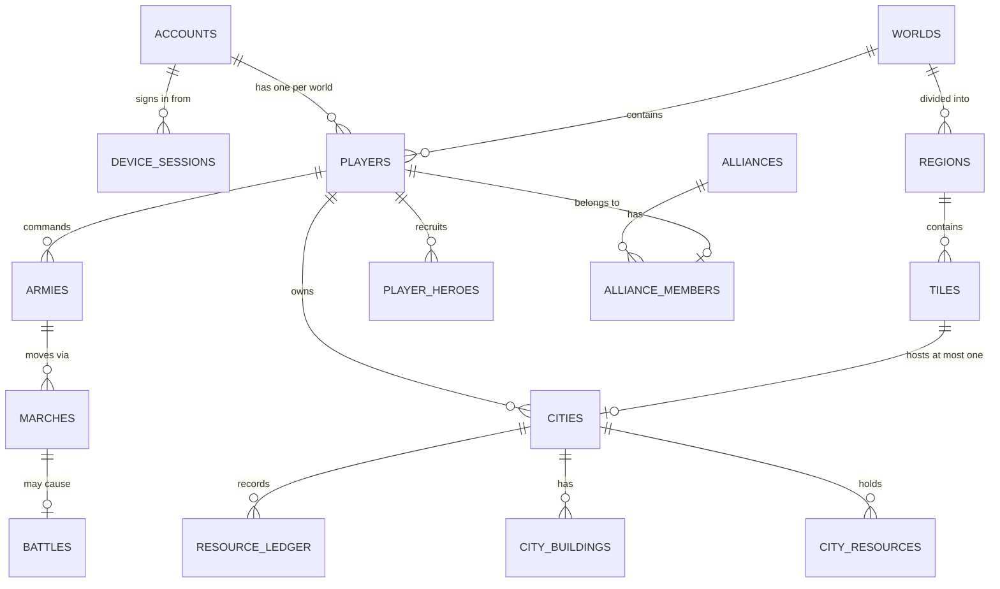

# Schema

The entity map. Binding rules for writing migrations are in
[`conventions.md`](conventions.md).

Tables are created by the phase that owns them — this document is the plan, not
the current state. Run `php artisan migrate:status` for reality.

## Core

## Table plan

| Table | Key | Notes | Phase |
|-------|-----|-------|-------|
| `accounts` | ULID | Credentials, guest flag, staff flag | 03 |
| `device_sessions` | ULID | `device_id`, `platform`, `ip`, `revoked_at` | 03 |
| `personal_access_tokens` | int | Sanctum; refresh family for rotation | 03 |
| `worlds` | ULID | Seed, status, capacity, opened_at | 05 |
| `regions` | ULID | `world_id`, PostGIS boundary + GiST index | 05 |
| `tiles` | ULID | `unique(world_id, x, y)`, terrain | 05 |
| `players` | ULID | `unique(account_id, world_id)`, name unique per world | 04 |
| `cities` | ULID | `unique(world_id, x, y)` — one city per tile | 07 |
| `city_resources` | int | `bigint` per resource, `CHECK (>= 0)`, `last_accrued_at` | 08 |
| `resource_ledger` | int | **Append-only.** source, destination, resource, amount, reason, reference, `economy_version` | 08 |
| `city_buildings` | ULID | slot, `building_code`, level | 09 |
| `building_upgrades` | ULID | `started_at`, `finishes_at`, `completed_at` | 09 |
| `player_technologies` | int | `technology_code`, level | 10 |
| `research_jobs` | ULID | Same timing triple | 10 |
| `city_troops` | int | `unit_code`, count, reserved count | 12 |
| `training_batches` | ULID | Same timing triple, quantity | 12 |
| `player_heroes` | ULID | level, experience, stars, assignment | 13 |
| `armies` | ULID | formation, hero, status | 14 |
| `army_units` | int | `unit_code`, count | 14 |
| `marches` | ULID | type, state, origin, target, `departs_at`, `arrives_at` | 15 |
| `npc_camps` | ULID | tile, level, `respawns_at` | 16 |
| `resource_nodes` | ULID | tile, resource, remaining, occupied_by | 16 |
| `battles` | ULID | `initial_state` JSONB, `seed`, `commands`, `simulation_version`, `combat_version` | 17 |
| `battle_participants` | int | side, player, losses | 17 |
| `territories` | ULID | PostGIS geometry + GiST, owner, influence | 21 |
| `alliances` | ULID | `unique(world_id, name)` | 22 |
| `alliance_members` | ULID | rank, joined_at | 22 |
| `alliance_ranks` | ULID | Bundles of permissions — **data, not names in code** | 22 |
| `rallies` | ULID | leader, `join_closes_at`, target | 24 |
| `chat_messages` | ULID | channel, sender, body — persisted for moderation | 25 |
| `market_orders` | ULID | offer, want, escrow, `expires_at` | 27 |
| `quests` / `player_quests` | ULID | Definitions imported from game data; progress per player | 28 |
| `idempotency_keys` | int | `unique(player_id, endpoint, key)`, stored response, 24h TTL | 03 |
| `audit_log` | ULID | **Immutable.** actor, action, target, before, after, reason, ip | 34 |
| `feature_flags` | ULID | key, enabled, rollout | 31 |

## Reference data

Buildings, units, technologies, heroes and counters are **imported** from
`packages/game-data` by `php artisan game:import-data`, keyed by a stable string
`code` so re-import is idempotent. They are not seeded, and they are not edited by
hand in production — the JSON in git is the reviewable source (ADR-013).

## Recurring shapes

**Timed operation.** `started_at`, `finishes_at`, `completed_at` (null until
done). Completion is guarded on `completed_at IS NULL` — never on `finishes_at`,
which does not record whether the work happened.

**Ledger entry.** Append-only, never updated, never soft-deleted. Summing it must
reproduce the balance exactly.

**Spatial.** PostGIS geometry with a GiST index, and an `EXPLAIN` assertion in a
test proving the planner uses it. These tests run against Postgres in CI — the
SQLite host suite cannot cover them.
