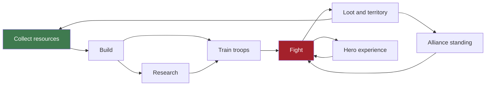

# Core loop

## The shape

Every arrow is a real dependency, and the loop closes: fighting produces the
resources and territory that fund more fighting.

## Timescales

The loop runs at three speeds simultaneously, which is what lets one game serve
both a commuter and an enthusiast.

| Speed | Duration | Activity | Serves |
|-------|----------|----------|--------|
| **Session** | 2–10 min | Collect, queue a build, send a gather, check chat | Everyone, several times a day |
| **Daily** | Hours | Finish upgrades, clear camps, daily quests, coordinate | Regular players |
| **Campaign** | Days–weeks | Wars, territory, seasons | Committed players and alliances |

A player who only ever plays the session layer must still progress. A player who
plays the campaign layer must have somewhere to put the extra attention.

## What makes each step interesting

**Collect** — production accrues offline, so opening the app is rewarding. Storage
caps mean ignoring it too long wastes output; that is the pull to return.

**Build** — the Palace gate forces a spine of decisions rather than one runaway
building. Queue slots make ordering a real choice.

**Research** — the tree is a DAG, so there are genuine branch decisions, not a
single line to walk.

**Train** — upkeep means a standing army has a cost. Bigger is not automatically
better, which is what makes composition matter.

**Fight** — the loss is real and permanent (minus hospital recovery). Committing
an army is the game's central risk.

**Loot and territory** — the payoff, and the reason to fight rather than turtle.

## Pressure and relief

A loop that is all pressure exhausts; all relief bores. The alternation is
deliberate:

| Pressure | Relief |
|----------|--------|
| Incoming attack warnings | Shields and beginner zones |
| Upkeep draining food | Territory bonuses |
| Storage caps wasting production | Warehouse upgrades |
| Rivals outgrowing you | Alliance support, seasons resetting standing |

## Failure states

Losing must sting without ending the relationship:

- Losing a battle costs troops — recoverable through the Hospital
- Losing a city costs territory — but **never the last one**
- Losing an alliance war costs standing — reset by seasons

There is no state from which a player cannot recover. That is a design rule, and
it is enforced in code (Phase 20).
