# Phase dependencies

Execution order is **not** a straight line. Several phases are genuinely
parallelisable, and knowing which ones can be worked simultaneously is the
difference between a sequential grind and a plan a team can actually run.

`.planning/ROADMAP.md` carries the authoritative `Depends on` for each phase.
This document visualises it.

## Dependency graph

```mermaid
graph TD
    subgraph Foundation["Foundation"]
        P00["00 Repository Bootstrap"]
        P01["01 Engineering Foundation"]
        P02["02 Design System and Mobile Shell"]
    end
    subgraph PlayablePrototype["Playable Prototype"]
        P03["03 Identity and Authentication"]
        P04["04 Player Profile and Onboarding"]
        P05["05 World Architecture"]
        P06["06 World Map Rendering"]
        P07["07 City Foundation"]
        P08["08 Resources and Economy"]
        P09["09 Buildings and Construction"]
        P10["10 Technology and Research"]
        P11["11 Unit System"]
        P12["12 Training System"]
    end
    subgraph InternalAlpha["Internal Alpha"]
        P13["13 Heroes"]
        P14["14 Army Composition"]
        P15["15 March System"]
        P16["16 PvE World Encounters"]
        P17["17 Combat Engine V1"]
        P18["18 Battle Visualization"]
    end
    subgraph MultiplayerAlpha["Multiplayer Alpha"]
        P19["19 PvP"]
        P20["20 Siege and City Capture"]
        P21["21 Territory System"]
        P22["22 Alliances"]
        P23["23 Alliance Territory"]
        P24["24 Rally and Reinforcements"]
        P25["25 Chat and Social"]
        P26["26 Diplomacy"]
        P27["27 Market and Trading"]
    end
    subgraph ClosedAlpha["Closed Alpha"]
        P28["28 Quests and Achievements"]
        P29["29 Nobility"]
        P30["30 Rankings"]
        P31["31 Events and LiveOps"]
        P32["32 Seasons"]
        P33["33 Notifications"]
        P34["34 Admin and Game Master Tools"]
        P35["35 Moderation"]
    end
    subgraph Beta["Beta"]
        P36["36 Analytics"]
        P37["37 Security and Anti-Cheat Hardening"]
        P38["38 Performance Optimization"]
        P39["39 Load Testing"]
        P40["40 Offline and Connectivity Resilience"]
        P41["41 Accessibility"]
        P42["42 Localization"]
        P43["43 Audio and Haptics"]
        P44["44 Visual Polish"]
        P45["45 Tutorial and FTUE Polish"]
        P46["46 Economy Balance Pass"]
        P47["47 Combat Balance Pass"]
    end
    subgraph ClosedAlphaRelease["Closed Alpha Release"]
        P48["48 Closed Alpha"]
    end
    subgraph BetaRelease["Beta Release"]
        P49["49 Beta"]
    end
    subgraph ReleaseCandidate["Release Candidate"]
        P50["50 Production Infrastructure"]
        P51["51 Store Release Pipeline"]
        P52["52 Launch Readiness"]
    end
    subgraph Launch["Launch"]
        P53["53 Global Launch"]
    end
    subgraph LiveOps["LiveOps"]
        P54["54 Post-launch LiveOps"]
    end

    P00 --> P01
    P00 --> P02
    P01 --> P03
    P03 --> P04
    P01 --> P05
    P05 --> P06
    P02 --> P06
    P04 --> P07
    P05 --> P07
    P07 --> P08
    P08 --> P09
    P06 --> P09
    P09 --> P10
    P10 --> P11
    P11 --> P12
    P09 --> P12
    P12 --> P13
    P13 --> P14
    P14 --> P15
    P06 --> P15
    P15 --> P16
    P16 --> P17
    P11 --> P17
    P17 --> P18
    P02 --> P18
    P18 --> P19
    P19 --> P20
    P20 --> P21
    P19 --> P22
    P22 --> P23
    P21 --> P23
    P23 --> P24
    P22 --> P25
    P24 --> P26
    P25 --> P26
    P22 --> P27
    P15 --> P27
    P27 --> P28
    P28 --> P29
    P29 --> P30
    P30 --> P31
    P31 --> P32
    P31 --> P33
    P31 --> P34
    P34 --> P35
    P25 --> P35
    P33 --> P36
    P36 --> P37
    P37 --> P38
    P38 --> P39
    P38 --> P40
    P40 --> P41
    P41 --> P42
    P42 --> P43
    P43 --> P44
    P44 --> P45
    P28 --> P45
    P45 --> P46
    P46 --> P47
    P47 --> P48
    P48 --> P49
    P49 --> P50
    P50 --> P51
    P51 --> P52
    P52 --> P53
    P53 --> P54

    style P00 fill:#3F7A4F,color:#fff
    style P01 fill:#B4762E,color:#fff
    style P03 fill:#B4762E,color:#fff
    style P04 fill:#B4762E,color:#fff
    style P07 fill:#B4762E,color:#fff
    style P08 fill:#B4762E,color:#fff
    style P09 fill:#B4762E,color:#fff
    style P10 fill:#B4762E,color:#fff
    style P11 fill:#B4762E,color:#fff
    style P12 fill:#B4762E,color:#fff
    style P13 fill:#B4762E,color:#fff
    style P14 fill:#B4762E,color:#fff
    style P15 fill:#B4762E,color:#fff
    style P16 fill:#B4762E,color:#fff
    style P17 fill:#B4762E,color:#fff
    style P18 fill:#B4762E,color:#fff
    style P19 fill:#B4762E,color:#fff
    style P22 fill:#B4762E,color:#fff
    style P27 fill:#B4762E,color:#fff
    style P28 fill:#B4762E,color:#fff
    style P29 fill:#B4762E,color:#fff
    style P30 fill:#B4762E,color:#fff
    style P31 fill:#B4762E,color:#fff
    style P33 fill:#B4762E,color:#fff
    style P36 fill:#B4762E,color:#fff
    style P37 fill:#B4762E,color:#fff
    style P38 fill:#B4762E,color:#fff
    style P40 fill:#B4762E,color:#fff
    style P41 fill:#B4762E,color:#fff
    style P42 fill:#B4762E,color:#fff
    style P43 fill:#B4762E,color:#fff
    style P44 fill:#B4762E,color:#fff
    style P45 fill:#B4762E,color:#fff
    style P46 fill:#B4762E,color:#fff
    style P47 fill:#B4762E,color:#fff
    style P48 fill:#B4762E,color:#fff
    style P49 fill:#B4762E,color:#fff
    style P50 fill:#B4762E,color:#fff
    style P51 fill:#B4762E,color:#fff
    style P52 fill:#B4762E,color:#fff
    style P53 fill:#B4762E,color:#fff
    style P54 fill:#B4762E,color:#fff
```



Green is complete. Bronze marks the **critical path** — the longest chain of
blocking dependencies, 42 phases deep. Slipping any of these slips the project;
everything else has slack.

## Critical path

```
00 → 01 → 03 → 04 → 07 → 08 → 09 → 10 → 11 → 12 → 13 → 14 → 15 → 16 → 17 → 18 → 19 → 22 → 27 → 28 → 29 → 30 → 31 → 33 → 36 → 37 → 38 → 40 → 41 → 42 → 43 → 44 → 45 → 46 → 47 → 48 → 49 → 50 → 51 → 52 → 53 → 54
```

| Phase | Name |
|-------|------|
| 00 | Repository Bootstrap |
| 01 | Engineering Foundation |
| 03 | Identity & Authentication |
| 04 | Player Profile & Onboarding |
| 07 | City Foundation |
| 08 | Resources & Economy |
| 09 | Buildings & Construction |
| 10 | Technology & Research |
| 11 | Unit System |
| 12 | Training System |
| 13 | Heroes |
| 14 | Army Composition |
| 15 | March System |
| 16 | PvE World Encounters |
| 17 | Combat Engine V1 |
| 18 | Battle Visualization |
| 19 | PvP |
| 22 | Alliances |
| 27 | Market & Trading |
| 28 | Quests & Achievements |
| 29 | Nobility |
| 30 | Rankings |
| 31 | Events & LiveOps |
| 33 | Notifications |
| 36 | Analytics |
| 37 | Security & Anti-Cheat Hardening |
| 38 | Performance Optimization |
| 40 | Offline & Connectivity Resilience |
| 41 | Accessibility |
| 42 | Localization |
| 43 | Audio & Haptics |
| 44 | Visual Polish |
| 45 | Tutorial & FTUE Polish |
| 46 | Economy Balance Pass |
| 47 | Combat Balance Pass |
| 48 | Closed Alpha |
| 49 | Beta |
| 50 | Production Infrastructure |
| 51 | Store Release Pipeline |
| 52 | Launch Readiness |
| 53 | Global Launch |
| 54 | Post-launch LiveOps |

## Parallelisable work

Phases at the same depth have no dependency on each other and can be worked
simultaneously by different people.

| Depth | Phases that can run in parallel |
|-------|--------------------------------|
| 2 | 01, 02 |
| 3 | 03, 05 |
| 4 | 04, 06 |
| 18 | 20, 22 |
| 19 | 21, 25, 27 |
| 20 | 23, 28 |
| 21 | 24, 29 |
| 22 | 26, 30 |
| 24 | 32, 33, 34 |
| 25 | 35, 36 |
| 28 | 39, 40 |

## Notable parallel opportunities

- **Phase 02 (Design System) alongside 03–05.** The mobile shell needs nothing
  from identity, world or economy. A designer and a backend engineer can start
  the same day.
- **Phase 05 (World Architecture) alongside 03–04.** World generation depends
  only on the engineering foundation, not on identity.
- **Phases 41–44 (accessibility, localisation, audio, polish)** are largely
  independent of each other once the surfaces they touch exist.
- **Phase 36 (Analytics) alongside 37 (Security).** Different subsystems,
  different people, no shared code.

## Dependency kinds

**Blocking** — the phase cannot start. Building construction (09) genuinely
cannot exist before resources (08); there is nothing to spend.

**Soft** — the phase can start but not finish. Battle visualisation (18) can
build its report screen against fixtures before the combat engine (17) is
complete, then wire it up.

**Reverse** — a later phase closes debt left by an earlier one. Every broadcast
channel stub in `routes/channels.php` (DEBT-001) is one of these: Phase 04
implements `player.{id}`, Phase 07 `city.{id}`, Phase 22 `alliance.{id}`.

The roadmap records blocking dependencies only. Soft ones are noted in the
relevant phase CONTEXT.

## Verifying before you start

```bash
node ~/.claude/get-shit-done/bin/gsd-tools.cjs roadmap get-phase NN
node ~/.claude/get-shit-done/bin/gsd-tools.cjs roadmap analyze
```

A phase whose dependencies are not `complete` must not be started. Stop and
say so rather than building on an absent foundation.
